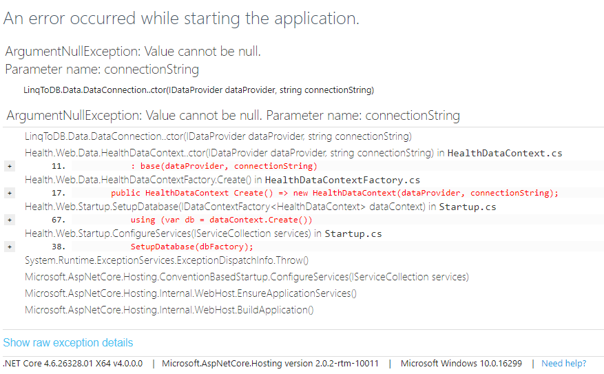

# Come creare un progetto ASP.NET Core
1. File > New > Project > ASP.NET Core Web Application
2. Scegliere il template "Empty" e quindi "No Authentication"; non selezionare "Enable Docker Support".
3. Come nome indicare "Health.Web"

Note: Provare a lanciare con IIS Express o direttamente, cambiare browser, avviare in debug mode o meno.

# MVC setup
ASP.NET Core MVC è disponibile sotto forma di pacchetto NuGet. Vediamo quindi come referenziarlo, farne il setup e creare un semplice controller.

1. Tasto destro sulla solution > Manage NuGet Packages for Solution
2. Cercare e referenziare "Microsoft.AspNetCore.Mvc"
3. Creare nel progetto il folder Controllers
4. Tasto destro su Controllers > Add > Controller... > MVC Controller Empty; dare il nome "HomeController" al controller appena creato
5. Codice del controller:

```csharp
using Microsoft.AspNetCore.Mvc;

namespace Health.Web.Controllers
{
    public class HomeController : Controller
    {
        public IActionResult Index() => Content("Hello MVC!");
    }
}
```

6. Modificare la classe Startup.cs come segue:

```csharp
using Microsoft.AspNetCore.Builder;
using Microsoft.AspNetCore.Hosting;
using Microsoft.AspNetCore.Http;
using Microsoft.Extensions.DependencyInjection;

namespace Health.Web
{
    public class Startup
    {
        public void ConfigureServices(IServiceCollection services)
        {
            services.AddMvc();
        }

        public void Configure(IApplicationBuilder app, IHostingEnvironment env)
        {
            if (env.IsDevelopment())
            {
                app.UseDeveloperExceptionPage();
            }

            app.UseStaticFiles();

            /*
             Shortcut per:

             routes.MapRoute(
                name: "default",
                template: "{controller=Home}/{action=Index}/{id?}");
             */
            app.UseMvcWithDefaultRoute();

            app.Run(async (context) =>
            {
                await context.Response.WriteAsync("Oops, something went wrong");
            });
        }
    }
}
```

> _app.UseMvcWithDefaultRoute()_ va messo dopo _app.UseStaticFiles()_ per evitare che il routing MVC intercetti le HTTP/GET ai file statici.

# Errori

Provare ora a modificare HomeController nel seguente modo:

```csharp
using Microsoft.AspNetCore.Mvc;
using System;

namespace Health.Web.Controllers
{
    public class HomeController : Controller
    {
        public IActionResult Index() => throw new DivideByZeroException("This exception is generated by controller");
    }
}
```

Navigando su _/home/index_ si ottiene una pagina con il dettaglio dell'eccezione:



Si noti ora il seguente frammento di codice in _Startup.cs_:

```csharp
public void Configure(IApplicationBuilder app, IHostingEnvironment env)
{
    if (env.IsDevelopment())
    {
        app.UseDeveloperExceptionPage();
    }
```

L'effetto è il seguente: se l'environment di esecuzione dell'applicazione ASP.NET è "development" allora, in caso di eccezione, va mostrata una pagina con il dettaglio dell'eccezione.
L'environment di esecuzione è letto dalla variabile d'ambiente _ASPNETCORE_ENVIRONMENT_.
In Visual Studio è possibile assegnare un valore alla variabile d'ambiente nel seguente modo:
1. click con il tasto destro sul progetto > Properties
2. fare click sul tab _Debug_
3. modificare il valore della variabile che di default vale "Development" e navigare nuovamente su _/home/index_.

# View
ASP.NET Core MVC utilizza l'approccio "convention over configuration" (https://it.wikipedia.org/wiki/Convention_Over_Configuration) per associare view a controller.
Vedimo come creare una view.

1. Aggiungere al progetto il folder Views
2. Aggiungere il folder Home come subfolder di Views (il folder deve avere lo stesso nome del controller a meno del suffisso "Controller")
3. Modificare HomeController come segue:

```csharp
using Microsoft.AspNetCore.Mvc;

namespace Health.Web.Controllers
{
    public class HomeController : Controller
    {
        public IActionResult Index()
        {
            ViewBag.Title = "Hello Razor";

            return View();
        }
    }
}
```

4. Tasto destro su Home > Add > View...:

>* *View name*: Index (la view deve avere il nome della action)
>* *Template*: Empty (without model)
>* *Create as a partial view*: non selezionato
>* *Use a layout page*: lasciare selezionato

5. Modificare il file Index.cshtml come segue:

```csharp
<!DOCTYPE html>
<html>
<head>
    <title>@ViewBag.Title</title>
</head>
<body>
    <h1>Hello Razor!</h1>
</body>
</html>
```

> E' possibile renderizzare un'altra view specificandone il nome nel seguente modo:

```csharp
using Microsoft.AspNetCore.Mvc;

namespace Health.Web.Controllers
{
    public class HomeController : Controller
    {
        public IActionResult Index()
        {
            ViewBag.Title = "Hello Razor";

            return View("Mobile");
        }
    }
}
```

> In questo caso ASP.NET MVC cercherebbe la view _/Views/Home/Mobile.cshtml_.

# Layout
Il layout permette di condividere tra le view le parti comuni di interfaccia, ad es. lo scheletro HTML della pagina.
Vediamo un esempio.

1. Creare il folder Shared all'interno di Views
2. Click con il tasto destro su Shared > Add > New Item...
3. Filtrare per "layout" e scegliere quindi "Razor Layout" lasciando il nome di default _Layout.cshtml
4. Modificare il file HomeController come segue:

```csharp
using Microsoft.AspNetCore.Mvc;

namespace Health.Web.Controllers
{
    public class HomeController : Controller
    {
        public IActionResult Index() => View();
    }
}
```

5. Modificare il file _Views/Home/Index.cshtml_ come segue:

```csharp
@{ 
    // /Views/Shared/_Layout.cshtml
    Layout = "_Layout";

    ViewBag.Title = "Hello Razor";
}

<h1>Hello Razor!</h1>
```

6. Tasto destro sul folder Views > Add > New Item...; filtrare per "razor" e scegliere "Razor View Start"
7. Lanciare e osservare il risultato.
8. E' possibile evitare di dover indicare esplicitamente il layout indicandone uno di default. Aggiungere il file __ViewStart.cshtml_ al folder _Views_:

```csharp
@{
    Layout = "_Layout";
}
```

9. E' quindi possibile rimuovere l'indicazione del layout in _Views/Home/Index.cshtml_:

```csharp
@{ 
    ViewBag.Title = "Hello Razor";
}

<h1>Hello Razor!</h1>
```

# Model
1. Aggiungere il folder Models a pari livello di Controllers e Views
2. Aggiungere nel folder Models il file Heartbeat.cs 

```csharp
using System;

namespace Health.Web.Models
{
    public class Heartbeat
    {
        public long Id { get; set; }

        public string DeviceId { get; set; }

        public DateTime Timestamp { get; set; }

        public int Value { get; set; }
    }
}
```

3. Tasto destro su Views > Add > New Item...; filtrare per "razor" e scegliere "Razor View Imports"; nel file così creato aggiungere:

```csharp
@using Health.Web.Models
```

4. Modificare HomeController.cs come segue:

```csharp
using Health.Web.Models;
using Microsoft.AspNetCore.Mvc;
using System;
using System.Linq;

namespace Health.Web.Controllers
{
    public class HomeController : Controller
    {
        static readonly string[] Devices = new[]
        {
            "Fitbit Alta",
            "Fitbit Charge 2",
            "Fitbit Ionic",
        };

        public IActionResult Index()
        {
            var random = new Random();

            var model =
                from i in Enumerable.Range(0, 10)
                let deviceId = Devices[random.Next(2)]
                select new Heartbeat
                {
                    Id = i,
                    DeviceId = deviceId,
                    Timestamp = DateTime.Now,
                    Value = random.Next(50, 80),
                };

            return View(model);
        }
    }
}
```

5. Modificare il file Home/Index.cshtml

```csharp
@model IEnumerable<Heartbeat>
@{
    ViewBag.Title = "Hello Razor";
}

<table border="1">
    @foreach (var p in Model)
    {
        <tr>
            <td>@p.Id</td>
            <td>@p.DeviceId</td>
            <td>@p.Timestamp</td>
            <td>@p.Value</td>
        </tr>
    }
</table>
```

# Kendo UI
1. Creare il folder kendo all'interno di wwwroot
2. Copiare i folder js e styles dalla directory di Kendo al folder wwwroot/kendo/2018.1.221 del progetto
3. Modificare il file Views/Shared/_Layout.cshtml come segue:

```csharp
<!DOCTYPE html>
<html>
<head>
    <title>@ViewBag.Title</title>

    <link href="//fonts.googleapis.com/css?family=Open+Sans:400,300,600,700&subset=all" rel="stylesheet" type="text/css" />

    <link href="~/kendo/2018.1.221/styles/kendo.common.min.css" rel="stylesheet" />
    <link href="~/kendo/2018.1.221/styles/kendo.material.min.css" rel="stylesheet" />

    <script src="~/kendo/2018.1.221/js/jquery.min.js"></script>
    <script src="~/kendo/2018.1.221/js/kendo.all.min.js"></script>

    <style>

        html, body {
            font-family: 'Open Sans', 'Segoe UI', Tahoma, Geneva, Verdana, sans-serif;
        }

    </style>
</head>
<body>
    @RenderBody()
</body>
</html>
```

4. Modificare il file Views/Home/Index.cshtml come segue:

```csharp
@model IEnumerable<Heartbeat>
@{ 
    ViewBag.Title = "Hello Razor";
}

<div id="grid"></div>

<script>

    $(document).ready(function () {
        var data = @(Json.Serialize(Model));

        $("#grid").kendoGrid({
            dataSource: {
                data: data,
                schema: {
                    model: {
                        fields: {
                            id: { type: "number" },
                            deviceId: { type: "string" },
                            timestamp: { type: "date" },
                            value: { type: "number" }
                        }
                    }
                }
            },
            scrollable: true,
            sortable: true,
            filterable: true,
            editable: false,
            columns: [
                "id",
                { field: "deviceId", title: "Device" },
                { field: "timestamp", title: "Date/Time", format: "{0:dd/MM/yyyy HH:mm:ss.fff}" },
                { field: "value", title: "Heartbeats" }
            ]
        });
    })

</script>
```

# Configurazione
1. Aggiungere al progetto il folder _Src_ e il subfolder _Health.Web.Configuration_
2. All'interno aggiungere la classe Kendo:

```csharp
namespace Health.Web.Configuration
{
    public class Kendo
    {
        public string Version { get; set; }
    }
}
```

3. Tasto dx sul progetto > Add > New Item...; filtrare per _appsettings_ e quindi aggiungere _App Settings File_
4. Modificare il file appsettings.json come segue:

```json
{
  "kendo": {
    "version": "2018.1.221"
  }  
}
```

5. Aggiungere il folder _Configuration_ alla pari di Controllers, Views, ...
6. All'interno del folder appena creato aggiungere il file _Kendo.cs_:

```csharp
namespace Health.Web.Configuration
{
    public class Kendo
    {
        public string Version { get; set; }
    }
}
```

7. Modificare _Startup.cs_ come segue:

```csharp
using Microsoft.AspNetCore.Hosting;
using Microsoft.AspNetCore.Http;
using Microsoft.Extensions.Configuration;
using Microsoft.Extensions.DependencyInjection;

namespace Health.Web
{
    public class Startup
    {
        public Startup(IConfiguration configuration)
        {
            Configuration = configuration;
        }

        public IConfiguration Configuration { get; }

        public void ConfigureServices(IServiceCollection services)
        {
            services.AddMvc();

            services.Configure<Kendo>(Configuration.GetSection("kendo"));
        }

        // ...       
    }
}
```

7. Modificare il file /Views/Shared/_Layout.cshtml nel seguente modo:

```csharp
@using Microsoft.Extensions.Options
@inject IOptions<Health.Web.Configuration.Kendo> Kendo

@{ 
    var kendo = Kendo.Value;
}

<!DOCTYPE html>
<html>
<head>
    <title>@ViewBag.Title</title>

    <link href="//fonts.googleapis.com/css?family=Open+Sans:400,300,600,700&subset=all" rel="stylesheet" type="text/css" />

    <link href="~/kendo/@(kendo.Version)/styles/kendo.common.min.css" rel="stylesheet" />
    <link href="~/kendo/@(kendo.Version)/styles/kendo.material.min.css" rel="stylesheet" />

    <script src="~/kendo/@(kendo.Version)/js/jquery.min.js"></script>
    <script src="~/kendo/@(kendo.Version)/js/kendo.all.min.js"></script>

    <style>

        html, body {
            font-family: 'Open Sans', 'Segoe UI', Tahoma, Geneva, Verdana, sans-serif;
        }
    </style>
</head>
<body>
    @RenderBody()
</body>
</html>
```

# Integrazione di un tema
1. Scaricare lo zip del tema: https://adminlte.io/ e decomprimerlo in /wwwroot/AdminLTE-2.4.3
2. Modificare _Layout.cshtml come segue:

```csharp
@using Microsoft.Extensions.Options
@inject IOptions<Health.Web.Configuration.Kendo> Kendo
@inject IOptions<Health.Web.Configuration.Theme> Theme

@{
    var kendo = Kendo.Value;
    var theme = Theme.Value;
}

<!DOCTYPE html>
<!--
This is a starter template page. Use this page to start your new project from
scratch. This page gets rid of all links and provides the needed markup only.
-->
<html>
<head>
    <meta charset="utf-8">
    <meta http-equiv="X-UA-Compatible" content="IE=edge">
    <title>@ViewBag.Title</title>
    <!-- Tell the browser to be responsive to screen width -->
    <meta content="width=device-width, initial-scale=1, maximum-scale=1, user-scalable=no" name="viewport">
    <link rel="stylesheet" href="~/AdminLTE-2.4.3/bower_components/bootstrap/dist/css/bootstrap.min.css">
    <!-- Font Awesome -->
    <link rel="stylesheet" href="~/AdminLTE-2.4.3/bower_components/font-awesome/css/font-awesome.min.css">
    <!-- Ionicons -->
    <link rel="stylesheet" href="~/AdminLTE-2.4.3/bower_components/Ionicons/css/ionicons.min.css">
    <!-- Theme style -->
    <link rel="stylesheet" href="~/AdminLTE-2.4.3/dist/css/AdminLTE.min.css">
    <!-- AdminLTE Skins. We have chosen the skin-blue for this starter
          page. However, you can choose any other skin. Make sure you
          apply the skin class to the body tag so the changes take effect. -->
    <link rel="stylesheet" href="~/AdminLTE-2.4.3/dist/css/skins/skin-blue.min.css">
    <!-- HTML5 Shim and Respond.js IE8 support of HTML5 elements and media queries -->
    <!-- WARNING: Respond.js doesn't work if you view the page via file:// -->
    <!--[if lt IE 9]>
    <script src="//oss.maxcdn.com/html5shiv/3.7.3/html5shiv.min.js"></script>
    <script src="//oss.maxcdn.com/respond/1.4.2/respond.min.js"></script>
    <![endif]-->
    <!-- Google Font -->
    <link rel="stylesheet" href="//fonts.googleapis.com/css?family=Source+Sans+Pro:300,400,600,700,300italic,400italic,600italic">

    <link href="~/kendo/@(kendo.Version)/styles/kendo.common.min.css" rel="stylesheet" />
    <link href="~/kendo/@(kendo.Version)/styles/kendo.material.min.css" rel="stylesheet" />

    <script src="~/kendo/@(kendo.Version)/js/jquery.min.js"></script>
    <script src="~/kendo/@(kendo.Version)/js/kendo.all.min.js"></script>
</head>
<!--
BODY TAG OPTIONS:
=================
Apply one or more of the following classes to get the
desired effect
|---------------------------------------------------------|
| SKINS         | skin-blue                               |
|               | skin-black                              |
|               | skin-purple                             |
|               | skin-yellow                             |
|               | skin-red                                |
|               | skin-green                              |
|---------------------------------------------------------|
|LAYOUT OPTIONS | fixed                                   |
|               | layout-boxed                            |
|               | layout-top-nav                          |
|               | sidebar-collapse                        |
|               | sidebar-mini                            |
|---------------------------------------------------------|
-->
<body class="hold-transition @(theme.Skin) @(theme.Layout)">
    <div class="wrapper">
        <!-- Main Header -->
        <header class="main-header">
            <!-- Logo -->
            <a href="index2.html" class="logo">
                <!-- mini logo for sidebar mini 50x50 pixels -->
                <span class="logo-mini">@ViewBag.LogoMini</span>
                <!-- logo for regular state and mobile devices -->
                <span class="logo-lg">@ViewBag.Logo</span>
            </a>
            <!-- Header Navbar -->
            <nav class="navbar navbar-static-top" role="navigation">
                <!-- Sidebar toggle button-->
                <a href="#" class="sidebar-toggle" data-toggle="push-menu" role="button">
                    <span class="sr-only">Toggle navigation</span>
                </a>
                <!-- Navbar Right Menu -->
                @{ await Html.RenderPartialAsync("NavbarRightMenu"); }
            </nav>
        </header>
        <!-- Left side column. contains the logo and sidebar -->
        <aside class="main-sidebar">
            <!-- sidebar: style can be found in sidebar.less -->
            <section class="sidebar">
                <!-- Sidebar user panel (optional) -->
                <!-- search form (Optional) -->
                <form action="#" method="get" class="sidebar-form">
                    <div class="input-group">
                        <input type="text" name="q" class="form-control" placeholder="Search...">
                        <span class="input-group-btn">
                            <button type="submit" name="search" id="search-btn" class="btn btn-flat">
                                <i class="fa fa-search"></i>
                            </button>
                        </span>
                    </div>
                </form>
                <!-- /.search form -->
                <!-- Sidebar Menu -->
                @{ await Html.RenderPartialAsync("SidebarMenu"); }
                <!-- /.sidebar-menu -->
            </section>
            <!-- /.sidebar -->
        </aside>
        <!-- Content Wrapper. Contains page content -->
        <div class="content-wrapper">
            <!-- Content Header (Page header) -->
            <section class="content-header">
                <h1>
                    @ViewBag.PageHeader
                </h1>
                @{ await Html.RenderPartialAsync("Breadcrumb"); }
            </section>
            <!-- Main content -->
            <section class="content container-fluid">
                @RenderBody()
            </section>
            <!-- /.content -->
        </div>
        <!-- /.content-wrapper -->
        <!-- Main Footer -->
        @{ await Html.RenderPartialAsync("Footer"); }
        <!-- Control Sidebar -->
        <aside class="control-sidebar control-sidebar-dark">
            <!-- Create the tabs -->
            <ul class="nav nav-tabs nav-justified control-sidebar-tabs">
                <li class="active"><a href="#control-sidebar-home-tab" data-toggle="tab"><i class="fa fa-home"></i></a></li>
                <li><a href="#control-sidebar-settings-tab" data-toggle="tab"><i class="fa fa-gears"></i></a></li>
            </ul>
            <!-- Tab panes -->
            <div class="tab-content">
                <!-- Home tab content -->
                <div class="tab-pane active" id="control-sidebar-home-tab">
                    <h3 class="control-sidebar-heading">Recent Activity</h3>
                    <ul class="control-sidebar-menu">
                        <li>
                            <a href="javascript:;">
                                <i class="menu-icon fa fa-birthday-cake bg-red"></i>
                                <div class="menu-info">
                                    <h4 class="control-sidebar-subheading">Langdon's Birthday</h4>
                                    <p>Will be 23 on April 24th</p>
                                </div>
                            </a>
                        </li>
                    </ul>
                    <!-- /.control-sidebar-menu -->
                    <h3 class="control-sidebar-heading">Tasks Progress</h3>
                    <ul class="control-sidebar-menu">
                        <li>
                            <a href="javascript:;">
                                <h4 class="control-sidebar-subheading">
                                    Custom Template Design
                                    <span class="pull-right-container">
                                        <span class="label label-danger pull-right">70%</span>
                                    </span>
                                </h4>
                                <div class="progress progress-xxs">
                                    <div class="progress-bar progress-bar-danger" style="width: 70%"></div>
                                </div>
                            </a>
                        </li>
                    </ul>
                    <!-- /.control-sidebar-menu -->
                </div>
                <!-- /.tab-pane -->
                <!-- Stats tab content -->
                <div class="tab-pane" id="control-sidebar-stats-tab">Stats Tab Content</div>
                <!-- /.tab-pane -->
                <!-- Settings tab content -->
                <div class="tab-pane" id="control-sidebar-settings-tab">
                    <form method="post">
                        <h3 class="control-sidebar-heading">General Settings</h3>
                        <div class="form-group">
                            <label class="control-sidebar-subheading">
                                Report panel usage
                                <input type="checkbox" class="pull-right" checked>
                            </label>
                            <p>
                                Some information about this general settings option
                            </p>
                        </div>
                        <!-- /.form-group -->
                    </form>
                </div>
                <!-- /.tab-pane -->
            </div>
        </aside>
        <!-- /.control-sidebar -->
        <!-- Add the sidebar's background. This div must be placed
    immediately after the control sidebar -->
        <div class="control-sidebar-bg"></div>
    </div>
    <!-- ./wrapper -->
    <!-- REQUIRED JS SCRIPTS -->
    <!-- jQuery 3 -->
    @*<script src="~/AdminLTE-2.4.3/bower_components/jquery/dist/jquery.min.js"></script>*@
    <!-- Bootstrap 3.3.7 -->
    <script src="~/AdminLTE-2.4.3/bower_components/bootstrap/dist/js/bootstrap.min.js"></script>
    <!-- AdminLTE App -->
    <script src="~/AdminLTE-2.4.3/dist/js/adminlte.min.js"></script>
    <!-- Optionally, you can add Slimscroll and FastClick plugins.
         Both of these plugins are recommended to enhance the
         user experience. -->
</body>
</html>
```

3. Aggiungere a Views/Shared il file Breadcrumb.cshtml:

```csharp
<ol class="breadcrumb">
    <li><a href="#"><i class="fa fa-dashboard"></i> Level</a></li>
    <li class="active">Here</li>
</ol>
```

4. Aggiungere a Views/Shared il file Footer.cshtml:

```csharp
<footer class="main-footer">
    <!-- To the right -->
    <div class="pull-right hidden-xs">
        Anything you want
    </div>
    <!-- Default to the left -->
    <strong>Copyright &copy; 2016 <a href="#">Company</a>.</strong> All rights reserved.
</footer>
```

5. Aggiungere a Views/Shared il file NavbarRightMenu.cshtml:

```csharp
<div class="navbar-custom-menu">
    <ul class="nav navbar-nav">
        <!-- Messages: style can be found in dropdown.less-->
        <li class="dropdown messages-menu">
            <!-- Menu toggle button -->
            <a href="#" class="dropdown-toggle" data-toggle="dropdown">
                <i class="fa fa-envelope-o"></i>
                <span class="label label-success">4</span>
            </a>
            <ul class="dropdown-menu">
                <li class="header">You have 4 messages</li>
                <li>
                    <!-- inner menu: contains the messages -->
                    <ul class="menu">
                        <li>
                            <!-- start message -->
                            <a href="#">
                                <div class="pull-left">
                                    <!-- User Image -->
                                    
                                </div>
                                <!-- Message title and timestamp -->
                                <h4>
                                    Support Team
                                    <small><i class="fa fa-clock-o"></i> 5 mins</small>
                                </h4>
                                <!-- The message -->
                                <p>Why not buy a new awesome theme?</p>
                            </a>
                        </li>
                        <!-- end message -->
                    </ul>
                    <!-- /.menu -->
                </li>
                <li class="footer"><a href="#">See All Messages</a></li>
            </ul>
        </li>
        <!-- /.messages-menu -->
        <!-- Notifications Menu -->
        <li class="dropdown notifications-menu">
            <!-- Menu toggle button -->
            <a href="#" class="dropdown-toggle" data-toggle="dropdown">
                <i class="fa fa-bell-o"></i>
                <span class="label label-warning">10</span>
            </a>
            <ul class="dropdown-menu">
                <li class="header">You have 10 notifications</li>
                <li>
                    <!-- Inner Menu: contains the notifications -->
                    <ul class="menu">
                        <li>
                            <!-- start notification -->
                            <a href="#">
                                <i class="fa fa-users text-aqua"></i> 5 new members joined today
                            </a>
                        </li>
                        <!-- end notification -->
                    </ul>
                </li>
                <li class="footer"><a href="#">View all</a></li>
            </ul>
        </li>
        <!-- Tasks Menu -->
        <li class="dropdown tasks-menu">
            <!-- Menu Toggle Button -->
            <a href="#" class="dropdown-toggle" data-toggle="dropdown">
                <i class="fa fa-flag-o"></i>
                <span class="label label-danger">9</span>
            </a>
            <ul class="dropdown-menu">
                <li class="header">You have 9 tasks</li>
                <li>
                    <!-- Inner menu: contains the tasks -->
                    <ul class="menu">
                        <li>
                            <!-- Task item -->
                            <a href="#">
                                <!-- Task title and progress text -->
                                <h3>
                                    Design some buttons
                                    <small class="pull-right">20%</small>
                                </h3>
                                <!-- The progress bar -->
                                <div class="progress xs">
                                    <!-- Change the css width attribute to simulate progress -->
                                    <div class="progress-bar progress-bar-aqua" style="width: 20%" role="progressbar"
                                         aria-valuenow="20" aria-valuemin="0" aria-valuemax="100">
                                        <span class="sr-only">20% Complete</span>
                                    </div>
                                </div>
                            </a>
                        </li>
                        <!-- end task item -->
                    </ul>
                </li>
                <li class="footer">
                    <a href="#">View all tasks</a>
                </li>
            </ul>
        </li>
        <!-- User Account Menu -->
        <li class="dropdown user user-menu">
            <!-- Menu Toggle Button -->
            <a href="#" class="dropdown-toggle" data-toggle="dropdown">
                <!-- The user image in the navbar-->
                
                <!-- hidden-xs hides the username on small devices so only the image appears. -->
                <span class="hidden-xs">Alexander Pierce</span>
            </a>
            <ul class="dropdown-menu">
                <!-- The user image in the menu -->
                <li class="user-header">
                    
                    <p>
                        Alexander Pierce - Web Developer
                        <small>Member since Nov. 2012</small>
                    </p>
                </li>
                <!-- Menu Body -->
                <li class="user-body">
                    <div class="row">
                        <div class="col-xs-4 text-center">
                            <a href="#">Followers</a>
                        </div>
                        <div class="col-xs-4 text-center">
                            <a href="#">Sales</a>
                        </div>
                        <div class="col-xs-4 text-center">
                            <a href="#">Friends</a>
                        </div>
                    </div>
                    <!-- /.row -->
                </li>
                <!-- Menu Footer-->
                <li class="user-footer">
                    <div class="pull-left">
                        <a href="#" class="btn btn-default btn-flat">Profile</a>
                    </div>
                    <div class="pull-right">
                        <a href="#" class="btn btn-default btn-flat">Sign out</a>
                    </div>
                </li>
            </ul>
        </li>
        <!-- Control Sidebar Toggle Button -->
        <li>
            <a href="#" data-toggle="control-sidebar"><i class="fa fa-gears"></i></a>
        </li>
    </ul>
</div>
```

6. Aggiungere a Views/Shared il file SidebarMenu.cshtml:

```csharp
<ul class="sidebar-menu" data-widget="tree">
    @*<li class="header">HEADER</li>*@
    <!-- Optionally, you can add icons to the links -->
    <li class="active"><a href="#"><i class="fa fa-link"></i> <span>Link</span></a></li>
    <li><a href="#"><i class="fa fa-link"></i> <span>Another Link</span></a></li>
    <li class="treeview">
        <a href="#">
            <i class="fa fa-link"></i> <span>Multilevel</span>
            <span class="pull-right-container">
                <i class="fa fa-angle-left pull-right"></i>
            </span>
        </a>
        <ul class="treeview-menu">
            <li><a href="#">Link in level 2</a></li>
            <li><a href="#">Link in level 2</a></li>
        </ul>
    </li>
</ul>
```

7. Aggiungere al folder _Configuration_ il file _Theme.cs_:

```csharp
using Health.Web.Extensions;
using System.ComponentModel;

namespace Health.Web.Configuration
{
    public class Theme
    {
        public string Skin { get; set; }

        public string Layout { get; set; }
    }
}
```

8. Modificare _appsettings.json_ in modo da rendere configurabili due aspetti (previsti) del tema:

```json
{
  "kendo": {
    "version": "2018.1.221"
  },
  "theme": {
    "skin": "skin-blue",
    "layout": "sidebar-mini"
  }
}
```

9. Iniettare (_Startup.cs_) la dipendenza della classe che raccoglie i settings in modo che siano disponibili in _Layout.cshtml:

```csharp
public void ConfigureServices(IServiceCollection services)
{
    services.AddMvc();

    services.Configure<Kendo>(Configuration.GetSection("kendo"));
    services.Configure<Theme>(Configuration.GetSection("theme"));
}
```

> Esercizi:
> * Fare in modo che nel footer appaiano numero di versione, company e copyright dell'applicazione: 

```csharp
Assembly.GetEntryAssembly().GetCustomAttribute<AssemblyInformationalVersionAttribute>()?.InformationalVersion
Assembly.GetEntryAssembly().GetCustomAttribute<AssemblyCopyrightAttribute>()?.Copyright
Assembly.GetEntryAssembly().GetCustomAttribute<AssemblyCompanyAttribute>()?.Company
```

> * Fare in modo che le property Skin e Layout di Theme siano vincolati ai soli valori previsti dal tema
> * Fare in modo che la breadcrumb mostri dinamicamente Controller > Action
> * Fare in modo che le voci del menù di sinistra siano caricate da un modello definito server-side (al momento una struttura dati in-memory costante)
> * Aggiungere la possibilità di configurare in _appsettings.json_ il tema Kendo da utilizzare.

# Servizi
Sviluppiamo ora la parte di accesso ai dati (Create Read Update Delete) sotto forma di servizi.
1. Referenziare i package _linq2db.Core_ e _Microsoft.Data.SQLite_
2. Nel folder _Models_ aggiungere il file _IHasId.cs_:

```csharp
namespace Health.Web.Models
{
    public interface IHasId<T>
    {
        T Id { get; set; }
    }
}
```

3. Nel folder _Models_ aggiungere il file _FitbitDevice.cs_:

```csharp
using LinqToDB.Mapping;

namespace Health.Web.Models
{
    public class FitbitDevice : IHasId<string>
    {
        [PrimaryKey]
        [NotNull]
        public string Id { get; set; }

        public string AccountId { get; set; }
    }
}
```

4. Modificare il file _Heartbeat.cs_ nel seguente modo:

```csharp
using LinqToDB.Mapping;
using System;

namespace Health.Web.Models
{
    public class Heartbeat : IHasId<long>
    {
        [PrimaryKey]
        [NotNull]
        [Identity]
        public long Id { get; set; }

        public DateTime Timestamp { get; set; }

        [NotNull]
        public string DeviceId { get; set; }

        [Association(ThisKey = nameof(DeviceId), OtherKey = nameof(FitbitDevice.Id), CanBeNull = false)]
        public FitbitDevice Device { get; set; }

        [NotNull]
        public int Value { get; set; }
    }
}
```

5. Aggiungere il folder _Data_
6. Aggiungere il file _IDataContextFactory.cs_ al folder _Data_:

```csharp
using LinqToDB.Data;

namespace Health.Web
{
    public interface IDataContextFactory<T>
        where T : DataConnection
    {
        T Create();
    }
}
```

7. Aggiungere il file _HealthDataContext.cs_ al folder _Data_:

```csharp
using Health.Web.Models;
using LinqToDB;
using LinqToDB.Data;
using LinqToDB.DataProvider;

namespace Health.Web.Data
{
    public class HealthDataContext : DataConnection
    {
        public HealthDataContext(IDataProvider dataProvider, string connectionString)
            : base(dataProvider, connectionString)
        { }

        public ITable<FitbitDevice> FitbitDevices => GetTable<FitbitDevice>();

        public ITable<Heartbeat> Heartbeats => GetTable<Heartbeat>();
    }
}
```

8. Aggiungere il file _HealthDataContextFactory.cs_ al folder _Data_:

```csharp
using LinqToDB.DataProvider;

namespace Health.Web.Data
{
    public class HealthDataContextFactory : IDataContextFactory<HealthDataContext>
    {
        readonly IDataProvider dataProvider;

        readonly string connectionString;

        public HealthDataContextFactory(IDataProvider dataProvider, string connectionString)
        {
            this.dataProvider = dataProvider;
            this.connectionString = connectionString;
        }

        public HealthDataContext Create() => new HealthDataContext(dataProvider, connectionString);
    }
}
```

9. Creare il folder _Extensions_ e all'interno aggiungere il file _DataConnectionExtensions.cs_:

```csharp
using LinqToDB;
using LinqToDB.Data;
using System;
using System.Threading.Tasks;

namespace Health.Web.Extensions
{
    public static class DataConnectionExtensions
    {
        public static void CreateTableIfNotExists<T>(this DataConnection db) => RunIgnoringException(() => db.CreateTable<T>());

        public static async Task CreateTableIfNotExistsAsync<T>(this DataConnection db) => await RunIgnoringExceptionAsync(async () => await db.CreateTableAsync<T>());

        static void RunIgnoringException(Action action)
        {
            if (action == null) return;

            try
            {
                action.Invoke();
            }
            catch
            { }
        }

        static async Task RunIgnoringExceptionAsync(Func<Task> action)
        {
            if (action == null) await Task.Yield();

            try
            {
                await action.Invoke();
            }
            catch
            { }
        }
    }
}
```

10. Iniettare in _Startup.cs_ la dipendenza che consentirà di creare istanze di _HealthDataContext_:

```csharp
using Health.Web.Configuration;
using Health.Web.Data;
using Health.Web.Extensions;
using Health.Web.Models;
using LinqToDB;
using LinqToDB.DataProvider.SQLite;
using Microsoft.AspNetCore.Builder;
using Microsoft.AspNetCore.Hosting;
using Microsoft.AspNetCore.Http;
using Microsoft.Extensions.Configuration;
using Microsoft.Extensions.DependencyInjection;
using System;

namespace Health.Web
{
    public class Startup
    {
        public Startup(IConfiguration configuration)
        {
            Configuration = configuration;
        }

        public IConfiguration Configuration { get; }

        public void ConfigureServices(IServiceCollection services)
        {
            services.AddMvc();

            services.Configure<Kendo>(Configuration.GetSection("kendo"));
            services.Configure<Theme>(Configuration.GetSection("theme"));

            var dbFactory = new HealthDataContextFactory(
                dataProvider: SQLiteTools.GetDataProvider(),
                connectionString: Configuration.GetConnectionString("Health")
            );

            services.AddSingleton<IDataContextFactory<HealthDataContext>>(dbFactory);
            SetupDatabase(dbFactory);
        }

        public void Configure(IApplicationBuilder app, IHostingEnvironment env)
        {
            if (env.IsDevelopment())
            {
                app.UseDeveloperExceptionPage();
            }

            app.UseStaticFiles();

            /*
             Shortcut per:

             routes.MapRoute(
                name: "default",
                template: "{controller=Home}/{action=Index}/{id?}");
             */
            app.UseMvcWithDefaultRoute();

            app.Run(async (context) =>
            {
                await context.Response.WriteAsync("Oops, something went wrong");
            });
        }

        void SetupDatabase(IDataContextFactory<HealthDataContext> dataContext)
        {
            using (var db = dataContext.Create())
            {
                db.CreateTableIfNotExists<FitbitDevice>();
                db.CreateTableIfNotExists<Heartbeat>();

                db.InsertOrReplace(new FitbitDevice { Id = "D1", AccountId = "A1" });
                db.InsertOrReplace(new FitbitDevice { Id = "D2", AccountId = "A2" });

                db.Insert(new Heartbeat { DeviceId = "D1", Timestamp = DateTime.Now, Value = 60 });
                db.Insert(new Heartbeat { DeviceId = "D1", Timestamp = DateTime.Now, Value = 80 });
                db.Insert(new Heartbeat { DeviceId = "D1", Timestamp = DateTime.Now, Value = 65 });
                db.Insert(new Heartbeat { DeviceId = "D2", Timestamp = DateTime.Now, Value = 60 });
                db.Insert(new Heartbeat { DeviceId = "D2", Timestamp = DateTime.Now, Value = 70 });
            }
        }
    }
}
```

# Riferimenti
* ASP.NET: https://docs.microsoft.com/en-us/aspnet/core/?view=aspnetcore-2.0
* Creazione di servizi REST: https://docs.microsoft.com/en-us/aspnet/core/tutorials/first-web-api?view=aspnetcore-2.0
* REST: https://it.wikipedia.org/wiki/Representational_State_Transfer
* Autenticazione: https://docs.microsoft.com/en-us/aspnet/core/security/authentication/?view=aspnetcore-2.0
* Razor syntax reference: https://docs.microsoft.com/en-us/aspnet/core/mvc/views/razor?view=aspnetcore-2.0
* Kendo UI book: http://codylindley.github.io/the-kendo-ui-book/
* Template UI: https://adminlte.io/
